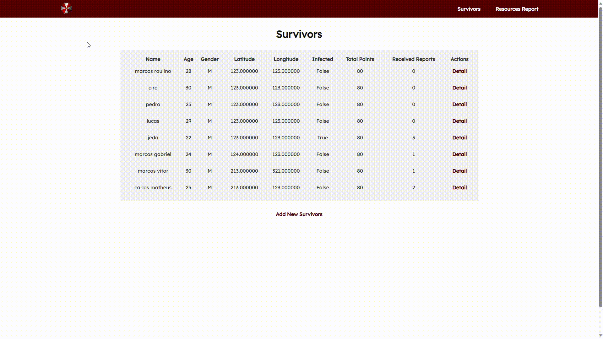

# API Documentation - Endpoints
This documentation provides detailed information on the API endpoints of the "ZSSN" project. This API allows you to manage survivors in a post-apocalyptic scenario, exchange items between survivors, report infections and get reports on resources and the survivor population.



## Base URL
The base URL for the API is https://zssn.onrender.com/api/. Make sure the Django server is running to access these endpoints.

## Available Endpoints
### 1. /survivors/
- HTTP Methods Supported: GET, POST
- Description: This endpoint allows you to list all existing survivors or add a new survivor.
- Usage example:
    - GET to list all existing survivors.
    - POST to add a new survivor with the data provided in the request body.

Example Request Data for POST:

```json
{
    "name": "Name of Survivor",
    "age": 30,
    "gender": "M",
    "latitude": 12.345678,
    "longitude": -45.678901,
    "water": 5,
    "food": 10,
    "medication": 3,
    "ammunition": 20,
    "is_infected": false
}
```

### 2. /survivors/<int:pk>/
- HTTP Methods Supported: GET, PUT
- Description: This endpoint allows you to view details of a specific survivor or update the information of an existing survivor.
- Usage example:
    - GET to view the details of a specific survivor based on ID (<int:pk>).
    - GET to view the details of a specific survivor based on ID (<int:pk>).

Example of Request Data for POST:
- HTTP Methods Supported: GET, POST
- Description: This endpoint allows you to list all existing survivors or add a new survivor.
- Usage Example:
    - GET to list all existing survivors.
    - POST to add a new survivor with the data provided in the request body.

Example Request Data for PUT:

```json
{
    "name": "New Name",
    "age": 35,
    "water": 7,
    "food": 12,
    "medication": 4,
    "ammunition": 18
}
```

### 3. /survivors/<int:pk>/report_infected/
- HTTP Methods Supported: PUT
- Description: This endpoint allows a survivor to report the infection of another survivor.
- Usage Example:
    - PUT to report the infection of another survivor based on the ID of the reporting survivor (<int:pk>).

Example Request Data for PUT:

```json
{
    "survivor_reported": 2
}
```

### 4. /survivors/<int:pk>/update_location/
- HTTP Methods Supported: PATCH
- Description: This endpoint allows a survivor to update their location (latitude and longitude).
- Usage example:
    - PATCH to update a survivor's location based on the ID (<int:pk>) and location data provided in the request body.

Example of Request Data for PATCH:

```json
{
    "latitude": 12.123456,
    "longitude": -34.567890
}
```

### 5. /survivors/make_trade/
- HTTP Methods Supported: POST
- Description: This endpoint allows two survivors to trade items with each other.
- Usage example:
    - POST to perform an exchange between two survivors, providing the survivor IDs and the items to be exchanged in the body of the request.

Example Request Data for POST:

```json
{
    "survivor1": 1,
    "survivor2": 3,
    "survivor1_items": [2, 5, 1, 0],
    "survivor2_items": [0, 4, 3, 2]
}
```

### 6. /survivors/get_resources_report/
- HTTP Methods Supported: GET
- Description: This endpoint returns a report on the available resources and the status of the survivor population.
- Usage example:
    - GET to get the report on available resources and the population of survivors.

Example Response:

```json
{
    "population": {
        "total": 10,
        "infected": 3,
        "non_infected": 7,
        "percent_infected": 30.0,
        "percent_non_infected": 70.0
    },
    "resources": {
        "water": {
            "total": 50,
            "average": 5.0
        },
        "food": {
            "total": 40,
            "average": 4.0
        },
        "medication": {
            "total": 15,
            "average": 1.5
        },
        "ammunition": {
            "total": 25,
            "average": 2.5
        }
    },
    "total_points_lost": 150
}
```

# Configurando e Executando o Projeto Python Localmente

## System requirements
ZSSN requires Python 3.11+ (it was developed with Python 3.11, so we do not guarantee it will work with earlier versions).

## Instruções

1. Verifique sua Instalação do Python
   Para garantir que o Python esteja instalado, execute o comando abaixo em seu terminal:

    ```bash
    python --version
    ```

   Se você tiver uma configuração diferente, pode ser necessário usar:

    ```bash
    python3 --version
    ```

2. Acesse o Diretório do Projeto
   Usando o terminal, navegue até o local onde o projeto foi salvo:

    ```bash
    cd caminho/para/o/diretorio/do/projeto
    ```
     
3. Instalação das Dependências
    Instale o poetry como gerenciador de pacotes:

    ```bash
    pip install poetry
    ```

4. Definição do local do ambiente virtual criado pelo poetry
    Usando o terminal, altere as configurações padrões do poetry para criar o ambiente virtual dentro do diretório do projeto:

    ```bash
    poetry config virtualenvs.in-project true
    ```

5. Instalação das Dependências:
    Instale as dependências que estão na raiz do projeto

    ```bash
    poetry install
    ```

6. Colete os arquivos estáticos do projeto

    ```bash
    python manage.py collectstatic
    ```

7. Crie o banco de dados

    ```bash
    python manage.py makemigrations
    ```
    ```bash
    python manage.py migrate
    ```

8. Execute a aplicação

    ```bash
    python manage.py runserver
    ```


